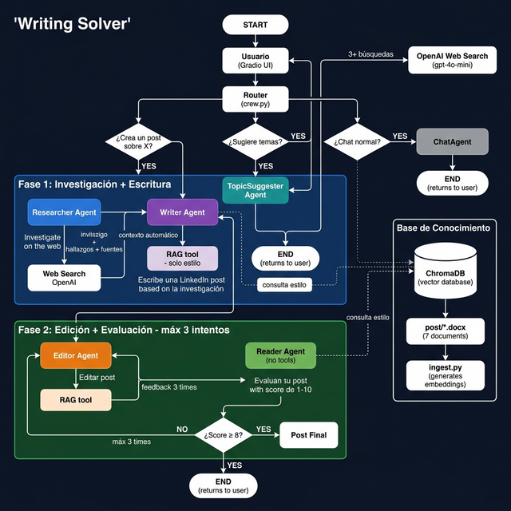

# Flujo del Proyecto — Writing Solver

---

## Resumen de responsabilidades

| Agente | Tool | Función |
|---|---|---|
| **Researcher** | `web_search` | Investiga el tema en la web — datos frescos |
| **Writer** | `rag_tool` (solo estilo) | Escribe el post usando la investigación |
| **Editor** | `rag_tool` | Mejora el post comparando con posts aprobados |
| **Reader** | Sin tools | Evalúa objetivamente (score 1-10) |
| **TopicSuggester** | `rag_tool` | Sugiere temas no cubiertos aún |
| **ChatAgent** | Sin tools | Chat directo sobre el post actual |

## Separación de fuentes

| Fuente | Qué responde | Quién la usa |
|---|---|---|
| **OpenAI Web Search** | Datos actuales del sector asegurador | Solo Researcher |
| **ChromaDB (RAG)** | Estilo y tono de posts de T&S | Writer, Editor, TopicSuggester |
